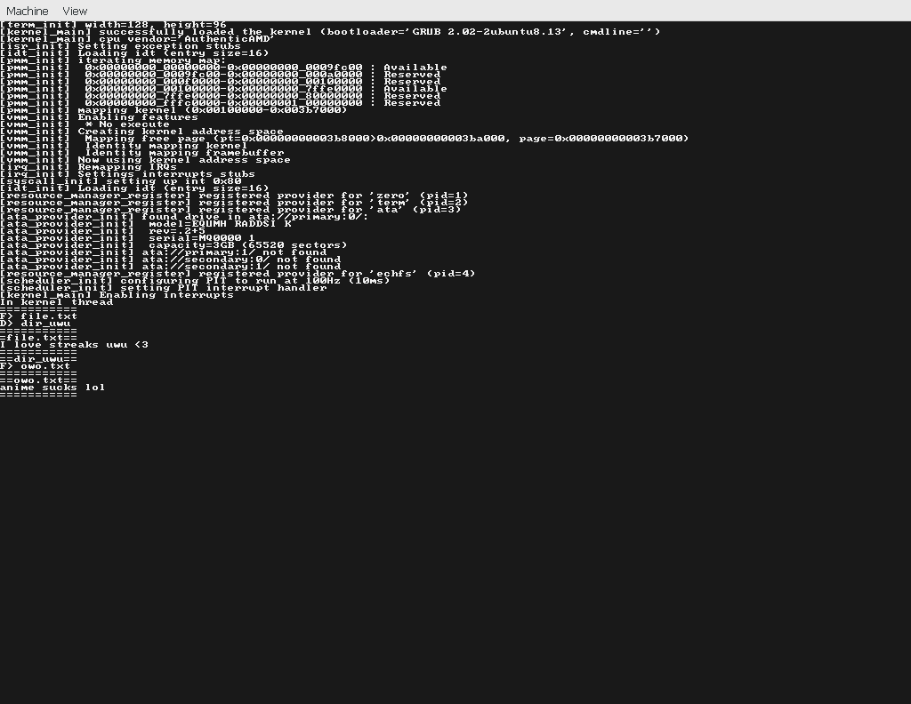

# TomatOS

TomatOS is a 64bit operating systems (currently just the kernel part of the os but still).

For specific information about the kernel you can go to the [kernel readme](kernel/README.md)

## Features

* 64bit with all the basic stuff like pmm, vmm, mm...
* Processes (Both kernel ones and user ones)
* Syscalls (open, close read, write, etc..)
* High-res support (currently still a terminal interface tho)
* Unique resource abstraction system (basically URI based)

## Providers

providers are basically drivers in TomatOS, they provider with function to do stuff with resources

* [`zero:///`](kernel/providers/zero/README.md)
* [`term:///`](kernel/providers/term/README.md)
* [`ata://<bus>:<port>/`](kernel/providers/ata/README.md)
* [`echfs://[]/<path>`](kernel/providers/echfs/README.md)

## TODO

### Working on

these are things that I am going to actively work on

* ELF loading
* write support for echfs

### Planned in the near future

these are things that I plan to implement after I finish working on what I worked till now

* Simple Shell (just allows to run programs)
* Text editing program